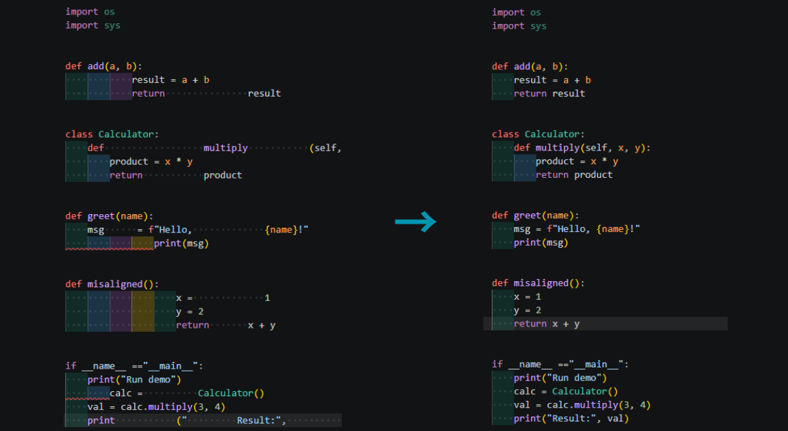

<p align="center">
  
</p>

> 🇫🇷 Français | [🇬🇧 English](./README.md)


[](https://palks-studio.com/fr/pack-environnement-vscode)

<p align="center">
  <a href="https://palks-studio.com">
    
  </a>
</p>

# VSCode – Pack environnement (Version 1.1)

Un environnement de travail **configuré** pour Visual Studio Code.

Ce pack fournit un cadre clair et cohérent pour le formatage, le nettoyage et la normalisation  
de fichiers courants (`.py`, `.html`, `.css`, `.js`, `.json`, `.txt`),  
à l’aide de réglages VS Code et de scripts Python exécutés localement.

L’objectif n’est pas d’automatiser à l’aveugle,  
mais de proposer un **ensemble d’outils maîtrisés**,  
permettant de garder le contrôle sur la structure, la lisibilité et la cohérence du code,  
quel que soit le système d’exploitation.

[](https://palks-studio.com/fr/pack-environnement-vscode)

---

## Pourquoi ce pack existe

La plupart des éditeurs modifient automatiquement le code lors de l’enregistrement des fichiers.  
Bien que pratique, ce fonctionnement peut introduire des changements inattendus,  
des différences de formatage ou des conflits entre extensions.

Ce pack adopte l’approche inverse :  

- aucun formatage automatique  
- aucune action cachée  
- des outils manuels exécutés uniquement lorsque nécessaire

L’objectif est de conserver un code stable, lisible et prévisible,  
tout en laissant le contrôle total au développeur.

Ce pack ne remplace pas des outils existants, il les organise dans un cadre cohérent, stable et prévisible.

---

## Structure du pack

```
vscode_pack_environnement_v1.1/
│
├── .vscode/
│   ├── settings.json           → Configuration complète de l’éditeur (indentation, encodage, lisibilité)
│   ├── keybindings.json        → Raccourcis personnalisés (navigation, édition)
│   ├── tasks.json              → Tâches VS Code pour exécution manuelle des outils
│   ├── launch.json             → Exécution de scripts dans l’environnement
│   └── extensions.json         → Gestion locale des extensions
│
├── scripts/
│   ├── cleaning.py             → Nettoyage et normalisation des fichiers
│   ├── conversion.py           → Gestion des formats et encodages
│   ├── analysis.py             → Analyse des fichiers (lecture seule)
│   └── backup.py               → Sauvegarde locale des fichiers
│
├── LICENCE.md                  → Conditions d’utilisation et cadre légal
│
└── docs/
    ├── README_COMMERCIAL.md    → Présentation du pack et usage public
    ├── README_TECHNIQUE.md     → Documentation technique et fonctionnement interne
    ├── INSTALL.md              → Guide d’installation et d’utilisation
    │
    └── exemples/
        ├── avant.py           → Fichiers exemples non structurés
        ├── apres.py           → Versions propres générées par le pack
        ├── convert_lf.mp4     → Fichiers CRLF convertis automatiquement en LF
        ├── indent_clean.mp4   → Correction instantanée des marges et indentations incorrectes
        ├── indent_python.mp4  → Fichier Python mal indenté corrigé automatiquement
        ├── backup.mp4         → Démonstration de la sauvegarde automatique à chaque Ctrl + S
        │                        et de la restauration d’un fichier supprimé depuis le dossier de sauvegarde
        └── space_clean.mp4    → Analyse d’un fichier volontairement cassé (détection des marges, lecture seule)
```


## Points forts

- Configuration complète et cohérente pour Python, HTML, CSS, JS, JSON et Markdown  
- Largeur de ligne définie autour de **100 caractères** pour une lecture confortable  
- Alignement visuel cohérent avec la minimap (sans coupures excessives)  
- Formatage et indentation **maîtrisés**, sans altération de la logique du code  
- Nettoyage des marges via des scripts dédiés (espaces, tabulations, lignes vides excessives)  
- Système de sauvegarde local permettant de restaurer des versions enregistrées en cas d’erreur  
- Raccourcis pratiques intégrés :  
  - `Alt + R` → Réindentation manuelle du fichier actif  
  - `Alt + M` → Afficher / masquer la minimap  
- Rendu lisible et aéré, sans surcharge visuelle inutile  
- Fonctionne de manière cohérente sur **Windows, macOS et Linux**  
- Paramétrage compatible avec des extensions courantes (facultatives)

---

## Nouveautés de la version 1.1

La section suivante décrit en détail la configuration technique incluse.
La plupart des utilisateurs peuvent utiliser l’environnement sans avoir besoin de lire cette partie intégralement.

### Trois modes d’exécution pour les scripts

Les scripts `clean.py`, `convert.py` et `space.py` peuvent être exécutés selon **trois modes distincts**, via les tâches VS Code :  

- **GLOBAL** → traite l’ensemble des fichiers pris en charge du projet  
- **FICHIER ACTIF** → agit uniquement sur le fichier actuellement ouvert  
- **SÉLECTION PERSONNALISÉE** → permet de définir manuellement les fichiers à traiter dans `tasks.json`

Ces modes offrent un contrôle précis et réduisent les risques de modification involontaire.

---

### Système de sauvegarde interne (`backup.py`)

La version 1.1 introduit un système de sauvegarde local, intégré au workflow :  

- Sauvegarde déclenchée à chaque enregistrement du fichier (**Ctrl + S**)  
via la tâche VS Code **Auto-Backup**  
- Aucune extension externe requise  
- Sauvegardes horodatées stockées dans `.backups/nom_du_fichier/`  
- Possibilité de restaurer une version précédemment enregistrée en cas d’erreur  

Ce système constitue une **alternative autonome à Local History**  
et fonctionne entièrement hors ligne, sur tous les systèmes d’exploitation.

### Documentation enrichie (INSTALL.md, README_TECHNIQUE.md)

La version 1.1 s’accompagne d’une documentation plus claire :  

- explication des trois modes d’exécution  
- schéma complet du système de sauvegarde  
- détails internes du comportement des scripts  
- compatibilité VS Code 1.90+ mise à jour

---

## Détails des réglages inclus

### `settings.json`

Les réglages fournis visent à offrir un environnement de travail cohérent et prévisible,
sans déclencher de formatage automatique non souhaité.

---

**Formatage global**  
- `formatOnSave` désactivé afin d’éviter les conflits avec des formateurs externes (Black, Prettier, etc.)  
- Indentation définie à **4 espaces**  
- Largeur de ligne configurée autour de **100 caractères**  
- Encodage configuré en **UTF-8**  
- Fin de ligne par défaut définie en **LF**  
- Paramètres visant à limiter les différences de rendu entre systèmes d’exploitation

**Lisibilité et confort visuel**  
- Retour à la ligne activé (`wordWrap: on`) pour une lecture continue  
- Visualisation des espaces significatifs (`renderWhitespace: boundary`)  
- Animation fluide du curseur et défilement progressif (`cursorSmoothCaretAnimation`, `smoothScrolling`)  
- Guides visuels discrets pour éviter toute surcharge inutile

**Interface**  
- Désactivation de l’ouverture en aperçu temporaire des fichiers  
- Niveau de zoom neutre  
- Terminal intégré configuré pour une lecture confortable (`fontSize: 14`)  
- Raccourcis clavier limités à des actions simples et explicites

**Protection et historique**  
- Paramètres compatibles avec l’utilisation d’un dossier de sauvegarde local (`.backups`)  
- Historique local activé dans Visual Studio Code  
- Exclusion automatique des dossiers techniques courants (`node_modules`, `.git`, `__pycache__`)

**Erreurs et repérage**  
- Paramétrage de l’extension **ErrorLens** pour un affichage direct des messages d’erreur  
- Style visuel volontairement sobre afin de ne pas perturber la lecture du code

---

### Langages pris en charge

Les réglages sont adaptés aux fichiers suivants :  

- **Python** :  
  - formatage via **autopep8** (indentation à 4 espaces), déclenché uniquement par la tâche dédiée

- **HTML / CSS / JS** :  
  - indentation gérée par l’éditeur  
  - aucune exécution automatique de formateur externe

- **JSON / JSONC** :  
  - indentation fixe  
  - absence de formatage automatique pour éviter toute casse des fichiers commentés

- **Markdown** :  
  - aucun formatage automatique  
  - contenu et sauts de ligne respectés

Le formatage automatique à la sauvegarde est volontairement désactivé  
afin de conserver un contrôle total sur les modifications appliquées.

### Prettier (paramétrage inclus)

Les réglages Prettier fournis définissent un cadre cohérent,  
sans déclencher de formatage automatique à la sauvegarde.

- Largeur de ligne configurée autour de **100 caractères**  
- Retrait configuré à **4 espaces**  
- Utilisation des guillemets simples (`'`) pour homogénéité  
- Virgules terminales activées (`trailingComma: es5`)  
- Gestion des espaces HTML configurée (`htmlWhitespaceSensitivity: ignore`)  
- Fin de ligne définie en **LF**

Ces paramètres sont compatibles avec Prettier,  
mais n’impliquent aucune exécution automatique du formateur.

---

### Ergonomie et navigation

Les réglages d’interface visent à offrir une navigation fluide et lisible,  
sans modifier le comportement standard de l’éditeur.

- Animation du curseur activée (`cursorSmoothCaretAnimation`)  
- Défilement progressif (`smoothScrolling`)  
- Mise en évidence de la ligne active (`renderLineHighlight`)  
- Minimap activable ou désactivable via **Alt + M**  
- Désactivation de l’ouverture en aperçu temporaire des fichiers

---

### Sauvegarde et historique

- Sauvegarde automatique désactivée afin de conserver un contrôle manuel  
- Fonction *Hot Exit* activée pour restaurer les fichiers ouverts après redémarrage  
- Historique local configuré dans Visual Studio Code  
- Dossier `.backups/` utilisé pour les sauvegardes via la tâche dédiée  
- Encodage UTF-8 et fins de ligne **LF** définis par défaut

---

### Productivité et propreté

- Aucun formatage automatique déclenché à la sauvegarde (`formatOnSave: false`)  
- Les opérations de nettoyage (espaces inutiles, lignes vides, marges)  
sont lancées manuellement via les tâches VS Code :  
  - **Terminal → Exécuter une tâche…**  
- Lors de la sauvegarde, VS Code applique uniquement ses règles natives :  
  - suppression des espaces en fin de ligne  
  - ajout d’un saut de ligne final  
- Aucun `runOnSave` ni exécution automatique d’autopep8 n’est activé par défaut  
- Les dossiers techniques courants sont exclus des opérations  
(`node_modules`, `.git`, `__pycache__`)

---

### Extensions intégrées

Le pack inclut un paramétrage adapté pour certaines extensions courantes :  

- **ErrorLens** — affichage direct des messages d’erreur  
- **Indent-Rainbow** — visualisation des niveaux d’indentation  
- **Auto-Rename-Tag** — synchronisation des balises HTML

Ces extensions restent facultatives et peuvent être désactivées librement.

---

### Optimisations générales

Les réglages visent à maintenir un environnement stable et lisible :  

- Réduction des extensions actives pour limiter les conflits  
- Interface volontairement sobre, sans surcharge visuelle  
- Organisation claire de l’espace de travail (éditeur, explorateur, terminal)  
- Désactivation de la prévisualisation automatique des fichiers  
- Compatible avec la synchronisation des paramètres VS Code (*Settings Sync*)  
- Adapté à un usage individuel comme collaboratif

Les performances et la consommation mémoire dépendent  
de l’environnement de l’utilisateur et de sa configuration système.

### keybindings.json

- `Alt + M` → bascule l’affichage de la minimap (vue latérale du code)  
- `Alt + R` → réindente le fichier actuellement actif

*Astuce : utilisez* **Ctrl + A** *avant* **Alt + R** *pour réindenter l’intégralité du fichier.*

---

### tasks.json

Tâches VS Code disponibles (exécutées manuellement) :  

- Formatage Python + nettoyage des marges  
*(autopep8 + `clean.py`, fichier actif)*  
- Nettoyage des marges (`clean.py`)  
- Détection des marges (`space.py` — analyse seule)  
- Conversion CRLF → LF (`convert.py`)

---

### launch.json

- Permet de lancer manuellement le **script Python actif** dans l’éditeur  
- Utile pour tester des fichiers Python individuellement

---

## À propos du formatage Python

- Le pack n’altère jamais la **logique** du code Python  
- Il agit uniquement sur la **forme** (indentation, espaces, lisibilité)  
- Si un fichier contient des erreurs de structure ou des blocs incohérents,  
aucun outil automatisé ne peut en déduire l’intention correcte  
- Une correction manuelle préalable peut être nécessaire avant d’exécuter  
les tâches utilisant autopep8 ou `clean.py`

---

## Scripts Python de maintenance

Les scripts peuvent être exécutés :  

- soit via les **tâches VS Code** fournies  
- soit manuellement depuis un terminal

---

### `clean.py`

- Nettoie les marges sur les fichiers pris en charge  
(`.html`, `.css`, `.js`, `.json`, `.py`, `.txt`)  
- Supprime les espaces inutiles, tabulations superflues  
- Limite les lignes vides consécutives à un maximum de 2

```bash
python clean.py
```


### `convert.py`

- Normalise les fins de ligne CRLF (Windows) en LF (Unix)  
- N’écrit dans un fichier que si une conversion est nécessaire

```bash
python convert.py
```


### `space.py`

Analyse les fichiers et détecte :  

- espaces multiples  
- tabulations  
- espaces en fin de ligne  
- lignes vides excessives (> 2)

Aucun fichier n’est modifié

```bash
python space.py
```


---

## Important — Comportement des scripts

Selon la tâche exécutée, les scripts (`clean.py`, `convert.py`, `space.py`) peuvent agir :  

- sur l’ensemble des fichiers pris en charge du projet  
- sur le fichier actuellement ouvert  
- ou sur une sélection définie manuellement

Une sauvegarde est créée lors de l’enregistrement du fichier (Ctrl + S),  
via la tâche VS Code Auto-Backup.

Les sauvegardes sont stockées dans le dossier `.backups/`  
sous forme de copies horodatées.

Des détails complémentaires sont disponibles dans le fichier `INSTALL.md`.

---

## Sécurité et intégrité

Tous les scripts fonctionnent localement : aucune connexion réseau,  
aucun transfert de données.

Les scripts de nettoyage et de conversion ignorent systématiquement  
le dossier `.backups/`.

Le code est lisible et modifiable, sans obfuscation  
ni dépendance à un service externe.

Compatible avec des environnements isolés  
(hors ligne, intranet, postes sécurisés).

---

## Contenu du pack

- settings.json — configuration de l’éditeur  
- keybindings.json — raccourcis clavier  
- tasks.json — tâches VS Code pour nettoyage et analyse  
- launch.json — exécution manuelle des scripts Python  
- clean.py, convert.py, space.py, backup.py — scripts de maintenance  
- docs/ — documentation technique et exemples  
- LICENCE.md — Conditions d’utilisation et cadre légal

---

## À qui s’adresse ce pack ?

- Aux développeurs qui souhaitent un environnement VS Code **configuré et cohérent**, sans passer du temps sur des réglages complexes  
- Aux créateurs de projets Python, HTML, CSS ou JSON recherchant un cadre de travail **stable et lisible**  
- À celles et ceux qui veulent maintenir un code **propre, aligné et homogène**, tout en gardant le contrôle sur les modifications appliquées

---

## Compatibilité et intégration

- Compatible avec **Visual Studio Code version récente**  
- Fonctionne sous **Windows**, **macOS** et **Linux**  
- Ne nécessite aucune extension payante ni service externe  
- Compatible avec la fonctionnalité **Settings Sync** de VS Code  
- Adapté à un usage **individuel** comme **collaboratif** (workspaces partagés)

---

## Workflow typique

1. Ouvrir le projet dans Visual Studio Code  
2. Travailler normalement et enregistrer les fichiers (Ctrl + S)  
3. Une sauvegarde locale est créée automatiquement  
4. Lancer les tâches de nettoyage ou de conversion uniquement lorsque nécessaire  
   (Terminal → Exécuter une tâche…)

Aucune action ne s’exécute automatiquement sans intervention de l’utilisateur.

---

## FAQ express

**Ce pack modifie-t-il mon VS Code ?**  
Non. Les réglages fournis sont appliqués **localement au dossier du projet**.  
Ils n’affectent pas les paramètres globaux de Visual Studio Code.

**Faut-il des extensions payantes ?**  
Non. Le pack repose uniquement sur des réglages VS Code et des scripts Python exécutés localement.

**Puis-je utiliser ce pack sur plusieurs ordinateurs ?**  
Oui. Les fichiers du pack peuvent être utilisés sur plusieurs machines.  
La synchronisation dépend de l’utilisation de **Settings Sync** ou du partage du dossier de projet.

---

**Palks Studio — Version 1.1**  
Compatible avec Visual Studio Code (Prettier désactivé localement).

© Palks Studio — voir LICENSE.md  
- https://palks-studio.com
